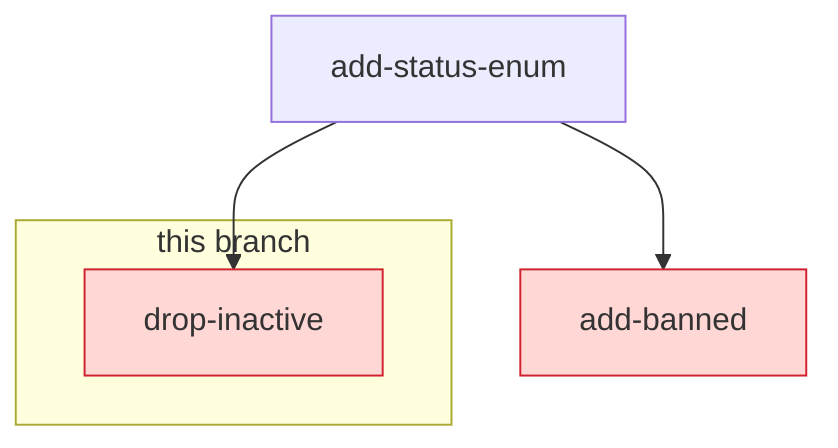

# Drizzle check action

Runs the drizzle-kit installed in your project (`drizzle-kit check --output json`) against the
checked-out repo and posts the result as a single sticky comment on the pull request. The comment
flips to green when migrations are commutative and shows a per-conflict report when they are not.
The step exits non-zero on conflicts, so CI goes red and the check can be marked as required.

## Usage

Add a step to a `pull_request`-triggered workflow that checks out the repo, installs your project's
dependencies (`pnpm` shown below; `npm`, `yarn`, and `bun` are also detected automatically), then
references this action. The package manager is auto-detected from the nearest lockfile at or above
`working-directory`.

```yaml
name: Drizzle check
on: pull_request

permissions:
  contents: read
  pull-requests: write

jobs:
  check:
    runs-on: ubuntu-latest
    steps:
      - uses: actions/checkout@v4

      - uses: pnpm/action-setup@v4
      - uses: actions/setup-node@v4
        with:
          node-version: 20
          cache: pnpm
      - run: pnpm install --frozen-lockfile

      - uses: drizzle-team/drizzle-orm/actions/check@main
```

## Custom config location

`drizzle.config.ts` at the repository root is used by default. If your config lives elsewhere or
has a different name, point the `config` input at it:

```yaml
      - uses: drizzle-team/drizzle-orm/actions/check@main
        with:
          config: config/drizzle.config.ts
```

## Monorepos

Run the check from the package that declares `drizzle-kit` by setting `working-directory`; the
`config` path is resolved relative to it:

```yaml
      - uses: drizzle-team/drizzle-orm/actions/check@main
        with:
          working-directory: packages/db
```

If `drizzle-kit` cannot be resolved in `working-directory` (for example, it is only installed in a
nested package), the action posts a setup-guidance comment and fails the step instead of running
the check.

## Inputs

| Input               | Description                                                                       | Default              |
| ------------------- | --------------------------------------------------------------------------------- | -------------------- |
| `config`            | Path to the drizzle config file, relative to `working-directory`.                 | `drizzle.config.ts`  |
| `working-directory` | Directory to run the check in (package manager detected from the nearest lockfile at or above it). | `.`                  |
| `github-token`      | Token used to post the sticky PR comment.                                         | `${{ github.token }}` |
| `graph-style`       | How the conflict graph is rendered in the PR comment: `mermaid`, `tree`, or `list`. | `mermaid`            |

## Conflict graph styles

When conflicts are found, the comment includes a graph of the affected part of the migration
history. Three styles are available via the `graph-style` input. The examples below all show the
same situation: the current branch adds `0005_drop-inactive` while the base branch already gained
`0005_add-banned`, both forked from `0004_add-status-enum` and both touching the `user_status`
enum.

### `mermaid` (default)

A Mermaid flowchart of the migration DAG — fork parents, conflicting branches, and the migrations
connecting them. Conflicting migrations are highlighted, this branch's migrations are grouped, and
the linked per-fork list of conflicts follows the graph (Mermaid nodes cannot link on GitHub):



- `drizzle/0005_drop-inactive` (this branch) — ⚠️ recreates enum `user_status` in schema `public`
- `drizzle/0005_add-banned` (from `main`) — ⚠️ alters enum `user_status` in schema `public`

### `tree`

A compact ASCII tree inside a diff-highlighted code block, mirroring the output of
`drizzle-kit check` in the terminal — conflicting migrations render as red lines:

```diff
  drizzle/0004_add-status-enum
- ├── drizzle/0005_drop-inactive (this branch)  ⚠ recreates enum `user_status` in schema `public`
- └── drizzle/0005_add-banned (from main)  ⚠ alters enum `user_status` in schema `public`
```

### `list`

A nested markdown list of the migration DAG with status markers; every migration links to its
folder at the checked commit:

- 🔀 `drizzle/0004_add-status-enum` *(fork point)*
  - 🔴 `drizzle/0005_drop-inactive` *(this branch)* — recreates enum `user_status` in schema `public`
  - 🔴 `drizzle/0005_add-banned` *(from `main`)* — alters enum `user_status` in schema `public`

## Permissions

The job needs `pull-requests: write` so the action can create and update the sticky comment.
The step exits non-zero when conflicts are detected, so it can be made a required check.

## Branch protection

The check runs on `pull_request` events, so it only sees the base branch as it was when the PR was
last pushed. If another PR with a conflicting migration merges first, the existing green check (and
comment) become stale — nothing re-runs them, and the conflict would only surface after both PRs
land. Re-running the workflow manually does not help either: a re-run reuses the merge commit from
the original event.

To close this gap, protect the base branch with both:

- the `check` job marked as a **required status check**, and
- **"Require branches to be up to date before merging"** enabled.

GitHub then forces the PR branch to be updated with the latest base before merging, which fires a
`synchronize` event and re-runs the check against the real merge result — conflicting migrations
flip the comment to red and block the merge instead of slipping through.
